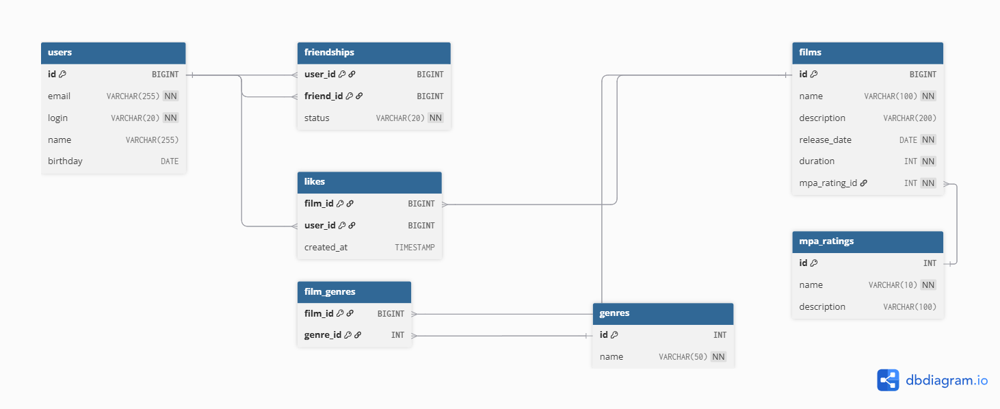

# Filmorate - Система управления фильмами и пользователями


**Filmorate** — это RESTful веб-приложение для управления информацией о фильмах и пользователях с системой рекомендаций на основе лайков и друзей. Разработано на Spring Boot с использованием современных практик Java-разработки.

---

## 🚀 Основные возможности

### 🎬 Управление фильмами:
- Создание, обновление и получение информации о фильмах
- Валидация данных фильмов (название, описание, дата релиза, продолжительность)
- Проверка уникальности фильмов по названию и году выпуска
- Автоматическая проверка минимальной даты релиза (28 декабря 1895 года)
- **Система лайков** - пользователи могут ставить лайки фильмам
- **Топ популярных фильмов** - рейтинг фильмов по количеству лайков

### 👥 Управление пользователями:
- Регистрация и обновление профилей пользователей
- Валидация email, логина и даты рождения
- Автоматическая нормализация данных (приведение email к нижнему регистру)
- Установка имени из логина, если имя не указано
- **Система друзей** - пользователи могут добавлять друг друга в друзья
- **Общие друзья** - просмотр общих друзей между пользователями

### 🛡️ Безопасность и валидация:
- Комплексная валидация входных данных
- Кастомные аннотации валидации (минимальная дата релиза)
- Обработка исключений с понятными сообщениями об ошибках
- Проверка на дубликаты (email, логин, фильмы)
- Глобальная обработка исключений с соответствующими HTTP-статусами

### 🧪 Тестирование:
- **Unit тесты** для контроллеров, сервисов и хранилищ
- **Интеграционные тесты** для проверки взаимодействия компонентов
- **Тесты валидации** моделей данных
- **Тесты обработки исключений**
- **Mock тестирование** для изолированной проверки компонентов
- **Тесты валидаторов** бизнес-логики

---

## 🛠 Технологический стек

- **Java 21**
- **Spring Boot 3.0+**
- **Spring Validation**
- **Spring Web**
- **Lombok**
- **Maven**
- **Jakarta Validation**
- **JUnit 5**
- **Mockito**
- **Hamcrest**

---

## 📋 API Endpoints

### 🎬 Фильмы

| Метод    | Endpoint                    | Описание                        |
|----------|-----------------------------|---------------------------------|
| `POST`   | `/films`                    | Создание нового фильма          |
| `GET`    | `/films`                    | Получение списка всех фильмов   |
| `GET`    | `/films/{id}`               | Получение фильма по ID          |
| `PUT`    | `/films`                    | Обновление существующего фильма |
| `PUT`    | `/films/{id}/like/{userId}` | Добавление лайка фильму         |
| `DELETE` | `/films/{id}/like/{userId}` | Удаление лайка у фильма         |
| `GET`    | `/films/popular`            | Получение популярных фильмов    |

### 👥 Пользователи

| Метод    | Endpoint                               | Описание                              |
|----------|----------------------------------------|---------------------------------------|
| `POST`   | `/users`                               | Создание нового пользователя          |
| `GET`    | `/users`                               | Получение списка всех пользователей   |
| `GET`    | `/users/{id}`                          | Получение пользователя по ID          |
| `PUT`    | `/users`                               | Обновление существующего пользователя |
| `PUT`    | `/users/{id}/friends/{friendId}`       | Добавление в друзья                   |
| `DELETE` | `/users/{id}/friends/{friendId}`       | Удаление из друзей                    |
| `GET`    | `/users/{id}/friends`                  | Получение списка друзей               |
| `GET`    | `/users/{id}/friends/common/{otherId}` | Получение общих друзей                |

---

## 🗄️ База данных

### Схема базы данных



### Основные таблицы и их назначение:

- **users** - хранит информацию о пользователях (email, логин, имя, дата рождения)
- **films** - содержит данные о фильмах (название, описание, дата релиза, продолжительность, рейтинг MPA)
- **friendships** - управляет связями дружбы между пользователями со статусами подтверждения
- **likes** - отслеживает лайки пользователей к фильмам
- **genres** - справочник жанров фильмов
- **film_genres** - связывает фильмы с их жанрами (многие-ко-многим)
- **mpa_ratings** - справочник рейтингов MPA (возрастных ограничений)

### Примеры SQL-запросов

#### Получение всех фильмов:
```sql
SELECT f.id, f.name, f.description, f.release_date, f.duration, 
       m.name as mpa_rating, m.description as mpa_description
FROM films f
JOIN mpa_ratings m ON f.mpa_rating_id = m.id
ORDER BY f.id;
```

#### Получение всех пользователей:

```sql
SELECT *
FROM users 
ORDER BY id;
```

#### Получение топ-N самых популярных фильмов:

```sql
SELECT f.*,
       m.name as mpa_rating,
       COUNT(l.user_id) as likes_count
FROM films f
JOIN mpa_ratings m ON f.mpa_rating_id = m.id
LEFT JOIN likes l ON f.id = l.film_id
GROUP BY f.id, f.name, f.description, f.release_date, f.duration, m.name
ORDER BY likes_count DESC
LIMIT 10;
```

#### Получение списка общих друзей:

```sql
SELECT u.*
FROM users u
JOIN friendships f1 ON u.id = f1.friend_id AND f1.user_id = ? AND f1.status = 'CONFIRMED'
JOIN friendships f2 ON u.id = f2.friend_id AND f2.user_id = ? AND f2.status = 'CONFIRMED'
WHERE u.id != ? AND u.id != ?;
```

#### Добавление фильма:

```sql
INSERT INTO films (name, description, release_date, duration, mpa_rating_id)
VALUES (?, ?, ?, ?, ?);
```

#### Добавление пользователя в друзья:

```sql
INSERT INTO friendships (user_id, friend_id, status) 
VALUES (?, ?, 'UNCONFIRMED');
```

## 🎯 Примеры использования

### **Создание фильма**

**Запрос:**
```http
POST /films
Content-Type: application/json

{
  "name": "Интерстеллар",
  "description": "Фантастический эпос о путешествии через червоточину",
  "releaseDate": "2014-10-26",
  "duration": 169
}
```

**Ответ:**
```json
{
  "id": 1,
  "name": "Интерстеллар",
  "description": "Фантастический эпос о путешествии через червоточину",
  "releaseDate": "2014-10-26",
  "duration": 169,
  "likes": []
}
```

### **Добавление лайка фильму**

```html
PUT /films/1/like/1
```

#### Ответ: 200 OK

### **Получение популярных фильмов**

**Запрос**

```html
GET /films/popular?count=5
```

#### Ответ
```json
[
  {
    "id": 1,
    "name": "Интерстеллар",
    "description": "Фантастический эпос о путешествии через червоточину",
    "releaseDate": "2014-10-26",
    "duration": 169,
    "likes": [1, 2, 3]
  }
]
```


### **Создание пользователя**

**Запрос:**
```http
POST /users
Content-Type: application/json

{
  "email": "user@example.com",
  "login": "user123",
  "name": "Иван Иванов",
  "birthday": "1990-01-01"
}
```

**Ответ**
```json
{
  "id": 1,
  "email": "user@example.com",
  "login": "user123",
  "name": "Иван Иванов",
  "birthday": "1990-01-01",
  "friends": []
}
```

### **Добавление в друзья**

```html
PUT /users/1/friends/2
```

#### Ответ: 200 OK

### **Получение общих друзей**

```html
GET /users/1/friends/common/2
```

#### Ответ:

```json
[
  {
    "id": 3,
    "email": "common@example.com",
    "login": "commonfriend",
    "name": "Общий Друг",
    "birthday": "1995-05-15",
    "friends": [1, 2]
  }
]
```


## 🏗 Архитектура проекта

```text
filmorate/

src/
├── main/java/ru/yandex/practicum/filmorate/
│   ├── annotation/              # Кастомные аннотации валидации
│   │   ├── MinReleaseDate.java           → Аннотация проверки даты релиза фильма
│   │   └── MinReleaseDateValidator.java  → Валидатор для аннотации MinReleaseDate
│   ├── controller/              # REST контроллеры
│   │   ├── AbstractController.java       → Абстрактный базовый контроллер
│   │   ├── FilmController.java           → Обработка CRUD операций для фильмов
│   │   └── UserController.java           → Обработка CRUD операций для пользователей
│   ├── exception/               # Кастомные исключения
│   │   ├── DuplicateException.java       → Ошибка дублирования данных
│   │   ├── NotFoundException.java        → Ошибка "не найдено"
│   │   ├── ValidationException.java      → Ошибка валидации
│   │   └── GlobalExceptionHandler.java   → Глобальный обработчик исключений
│   ├── management/              # Слой хранения данных
│   │   ├── FilmStorage.java              → Интерфейс хранилища фильмов
│   │   ├── InMemoryFilmStorage.java      → In-memory реализация для фильмов
│   │   ├── UserStorage.java              → Интерфейс хранилища пользователей
│   │   └── InMemoryUserStorage.java      → In-memory реализация для пользователей
│   ├── model/                   # Модели данных
│   │   ├── Film.java                     → Сущность фильма
│   │   ├── User.java                     → Сущность пользователя
│   │   ├── Friendship.java               → Сущность дружбы
│   │   ├── FriendshipStatus.java         → Статусы дружбы
│   │   ├── Genre.java                    → Жанры фильмов
│   │   └── MpaRating.java                → Рейтинги MPA
│   ├── service/                 # Сервисный слой (бизнес-логика)
│   │   ├── film/
│   │   │   ├── FilmService.java                  → Интерфейс сервиса фильмов
│   │   │   ├── FilmServiceImpl.java              → Реализация сервиса фильмов
│   │   │   └── validation/
│   │   │       ├── FilmValidatorRules.java       → Интерфейс валидатора фильмов
│   │   │       └── FilmValidatorImpl.java        → Реализация валидатора фильмов
│   │   └── user/
│   │       ├── UserService.java                  → Интерфейс сервиса пользователей
│   │       ├── UserServiceImpl.java              → Реализация сервиса пользователей
│   │       └── validation/
│   │           ├── UserValidatorRules.java       → Интерфейс валидатора пользователей
│   │           └── UserValidatorImpl.java        → Реализация валидатора пользователей
│   └── FilmorateApplication.java                 → Главный класс Spring Boot приложения
│
├── test/java/ru/yandex/practicum/filmorate/
│   ├── controller/              # Тесты контроллеров
│   │   ├── FilmControllerTest.java                → Тесты FilmController
│   │   └── UserControllerTest.java                → Тесты UserController
│   ├── exception/               # Тесты исключений
│   │   └── GlobalExceptionHandler.java            → Тесты обработки исключений
│   ├── management/              # Тесты хранилища
│   │   ├── InMemoryFilmStorageTest.java           → Тесты хранилища фильмов
│   │   └── InMemoryUserStorageTest.java           → Тесты хранилища пользователей
│   ├── model/                   # Тесты моделей
│   │   ├── FilmValidationTest.java                → Тесты валидации фильмов
│   │   └── UserValidationTest.java                → Тесты валидации пользователей
│   ├── service/                 # Тесты сервисного слоя
│   │      ├── FilmServiceImplTest.java            → Тесты сервиса фильмов
│   │      ├── UserServiceImplTest.java            → Тесты сервиса пользователей
│   │      ├── film/validation/              # Тесты валидаторов
│   │      │     └── FilmValidatorImplTest.java    → Тесты валидатора фильмов
│   │      └── user/validation/
│   │            └── UserValidatorImplTest.java    → Тесты валидатора пользователей
│   └── FilmorateApplicationTests.java             → Интеграционные тесты приложения
│
└── README.md                                      → Документация проекта
```

## 🧪 Типы тестов

### 🎯 Unit тесты контроллеров

- FilmControllerTest - тестирование endpoints для фильмов
- UserControllerTest - тестирование endpoints для пользователей
- Проверка CRUD операций, лайков, друзей
- Mock-тестирование с изоляцией зависимостей

### 🛡️ Тесты обработки исключений
- GlobalExceptionHandlerTest - тестирование обработки различных типов ошибок
- Проверка HTTP статусов и форматов ответов

### 💾 Тесты хранилищ данных
- InMemoryFilmStorageTest - тестирование операций с фильмами
- InMemoryUserStorageTest - тестирование операций с пользователями
- Проверка потокобезопасности и целостности данных

### 📋 Тесты валидации моделей
- FilmValidationTest - тестирование аннотаций валидации фильмов
- UserValidationTest - тестирование аннотаций валидации пользователей
- Проверка граничных случаев и некорректных данных

### 🔍 Тесты валидаторов бизнес-логики
- FilmValidatorImplTest - тестирование валидации уникальности фильмов
- UserValidatorImplTest - тестирование валидации уникальности пользователей
- Проверка сценариев создания и обновления
- Тестирование обработки дубликатов и исключительных ситуаций

## Запуск тестов
```bash
# Запуск всех тестов
mvn test

# Запуск тестов с детальным выводом
mvn test -Dmaven.test.failure.ignore=false

# Запуск конкретного тестового класса
mvn test -Dtest=FilmControllerTest

# Запуск тестов с генерацией отчета
mvn test surefire-report:report

# Запуск тестов валидаторов
mvn test -Dtest="*ValidatorImplTest"
```

### Покрытие тестами
- **Контроллеры:** Полное покрытие всех endpoints
- **Сервисы:** Тестирование бизнес-логики
- **Хранилища:** Тестирование операций CRUD
- **Валидация:** Тестирование всех аннотаций валидации
- **Исключения:** Тестирование обработки ошибок
- **Валидаторы:** Полное покрытие бизнес-валидации

## ⚙️ Установка и запуск
### Предварительные требования
- **Java 21 или выше**

- **Maven 3.6 или выше**

### Сборка и запуск
1. **Клонирование репозитория:
```bash
    git clone <repository-url>
    cd filmorate
```

2. **Сборка проекта**
```bash
    mvn clean package
```

3. **Запуск приложения**
```bash
    mvn spring-boot:run
```

4. **Проверка работы приложения**

**Приложение будет доступно по адресу: http://localhost:8080**

### Запуск в IDE
- Импортируйте проект как Maven проект в вашу IDE
- Запустите класс FilmorateApplication

## 🧪 Тестирование
**Для тестирования API можно использовать:**

- Postman - коллекция запросов
- curl - командная строка
- Swagger UI - автоматическая документация API

### Пример тестирования с curl:
**Создание пользователя:**

```bash
curl -X POST http://localhost:8080/users \
  -H "Content-Type: application/json" \
  -d '{
    "email": "test@example.com",
    "login": "test_user",
    "name": "Test User",
    "birthday": "1995-05-15"
  }'
```

**Добавления лайка:**

```bash
curl -X PUT http://localhost:8080/films/1/like/1
```

**Получение популярных фильмов:**

```bash
curl http://localhost:8080/films/popular?count=3
```

## 🐛 Обработка ошибок
**Приложение возвращает стандартизированные ответы об ошибках:**

- 400 Bad Request - ошибки валидации

- 404 Not Found - ресурс не найден

- 409 Conflict - конфликт данных (дубликаты)

- 500 Internal Server Error - внутренние ошибки сервера

**Пример ответа с ошибкой:**
```json
{
  "error": "Ошибка валидации",
  "message": "email: Некорректный email"
}
```

## 🎯 Ключевые особенности реализации

### 🎬 Система лайков для фильмов

- Пользователи могут ставить/убирать лайки фильмам
- Рейтинг популярности на основе количества лайков
- Потокобезопасная реализация с использованием ConcurrentHashMap

### 👥 Система друзей

- Двусторонняя дружба (автоматическое добавление в друзья друг другу)
- Просмотр общих друзей между пользователями
- Валидация существования пользователей при операциях с друзьями

### 🔍 Валидация и бизнес-логика

- Специализированные валидаторы для фильмов и пользователей\
- Кастомная аннотация @MinReleaseDate для проверки даты релиза
- Проверка уникальности email, логина, названия фильма + года
- Нормализация данных (имя из логина)

### 🎪 Архитектура контроллеров
- Абстрактный базовый контроллер AbstractController для переиспользования CRUD операций
- Специализированные контроллеры для расширенного функционала
- Единообразная обработка запросов и логирование

### 🛡️ Обработка исключений
- Глобальный обработчик исключений GlobalExceptionHandler
- Специализированные исключения для разных сценариев
- Стандартизированные JSON-ответы об ошибках

### 🧪 Комплексное тестирование
- Многоуровневое тестирование (unit, integration, validation)
- Mock-тестирование для изоляции компонентов
- Тестирование граничных случаев и некорректных данных
- Тестирование обработки исключений и HTTP статусов
- Тестирование валидаторов бизнес-логики

### 💾 Хранилище данных

- In-memory реализация с потокобезопасными структурами данных
- Индексы для быстрого поиска по email, логину, названию фильма
- Автоматическая генерация ID

## 🧩 Возможные улучшения
- Интеграция с базой данных (PostgreSQL)
- Добавление аутентификации и авторизации
- Кэширование для улучшения производительности
- Поиск фильмов по различным критериям
- Документация API через Swagger/OpenAPI

## 📌 Лицензия

Проект лицензирован под [MIT License].

📞 **Контакты**  
Если у вас есть вопросы или предложения, вы можете связаться с автором через:
- **Github:** [Alex Galvinauskas](https://github.com/Alex-Galvinauskas)
- **Telegram:** [https://t.me/Alex_Galvinauskas](https://t.me/Alex_Galvinauskas)